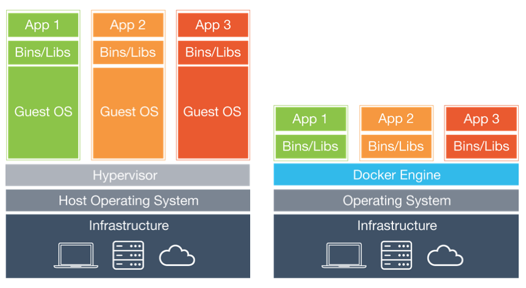
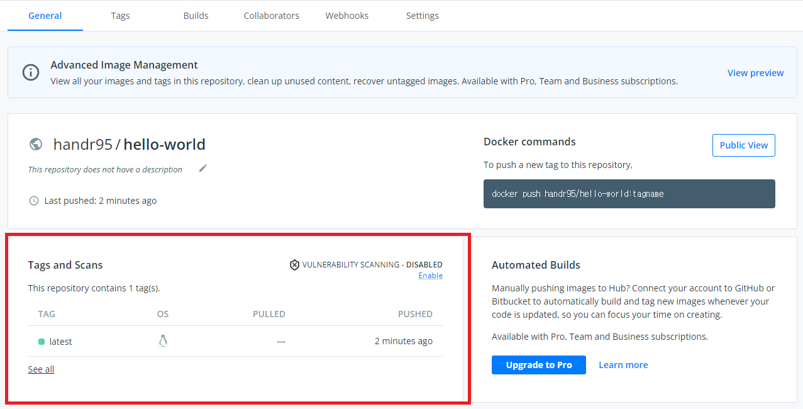

[TOC]

# 도커란


> ### **컨테이너를 생성하고 관리하기 위한 도구**


## 1. 컨테이너란?

- 

- 컨테이너는 "**표준화된 소프트웨어 유닛 = 코드 패키지**"

- 코드 패키지에는 해당 코드를 실행하는데 필요한 종속성과 도구가 포함되어있음
  
  - ex) 자바 애플리케이션를 띄우는데 필요한 자바 코드와 톰캣 서버 레디스 서버....
  - 동일 컨테이너는 동일한 환경 설정(ex. 자바 버전, 톰캣 버전, 빌드 파일 등)을 제공함
  - 따라서 컨테이너를 배포하면 다른 머신에서도 동일한 코드 버전등 동일한 환경의 머신이 세팅 할 수 있다.
  
- **도커**는 이러한 **컨테이너**를 구축하기 위한 도구

  

## 2. 컨테이너와 가상 머신 비교



### Virtual Machines 

- 내 운영 체제 위에 설치를 한다. 컴퓨터 내부의 컴퓨터
  - 해당 가상 머신에는 그 가상 머신 내부에서 실행되는 자체 운영 체제인 가상 운영 체제(ex. 리눅스, 윈도우 등)가 있음.
- 해당 가상 머신은 컴퓨터와 같기 때문에 에뮬레이트를 할수도 있도 내부에 추가 도구도 설치 할 수 있음.
  - 가상 머신 내에 자바 코드 톰캣 서버 레디스등 설치가 가능하기 떄문에 도커의 컨테이너와 동일한 결과를 얻을 수 있다.

- 내 운영체제 내에 여러대를 띄울수도 있수도 있고, 내 설정을 공유 할수도 있음.
- **but, 가상 운영체제를 여러대를 띄우게 될 경우 오버 헤드가 발생 될 수 있다.**
  - 모든 버츄얼 머신은 실제로 우리 머신 위에서 실행되는 standalone 컴퓨터와 동일
  - 여러대 있는 경우 매번 새로운 컴퓨터를 머신 내부에 설치해야한다.
  - 모든 가상 머신에서 리눅스를 사용한다고 해도 각각의 가상머신에 별도로 설치되어야한다.
  - 메모리, CPU, 하드 드라이브의 공간을 낭비하게됨
- **장점** 
  - 분리된 환경 생성 가능, 그 안에 환경별 구성을 가질 수 있음. 
  - 모든것을 안정적으로 공유하고 재생산 할 수 있음.
- **단점** 
  -  중복 복제 -> 낭비되는 공간이 발생하게됨. 
  - 호스트 시스템 위에 추가 시스템이 실행되고 있기 때문에 성능이 나빠질 수 있음. 
  - 재생산 및 공유가 가능하더라도 원하는 모든 시스템에 해당 버츄얼 머신을 설정해야한다.(공유 할 수 있는 단일 구성 파일이 없다)


### Containters

- 내 운영 체제 위에 가상 머신 처럼 몇대의 머신을 설치하지는 않음. 
  - 그 대신 운영 체제가 기본적으로 내재하고 있거나 컨테이너 애뮬레이트를 지원하는 내장 컨테이너를 활용한다.
- 그위에 도커 엔진이라는 도구를 실행 (해당 도구는 도커를 설치할때 자동으로 설정됨)
  - 현재 시스템에서 실행되는 도커 엔진을 기반으로 하여 컨테이너를 가동할 수 있다.
- 컨테이너 내부에 작은 운영 체제 레이어가 있을 순 있지만 가상 머신에 설치하는 것보다 **훨씬 작은운영 제체의 가벼운 버전**
- 구성 파일을 사용하여 컨테이너를 구성하고 해당 파일을 다른 사람과 공유하여 컨테이너를 새로 구성할수 있게하며
- 컨테이너를 이미지라 불리우는 것에 빌드 할수도 있다.
  - 그 이미지를 다른 사람과 공유하여 모든 사람이 자신의 시스템에서 내 시스템에 있는 동일한 컨테이너를 시작할 수 있도록 할 수 있다. 


### Containter vs Vitual Machines

| DOCKER | VITUAL MACHINES |
| ------------------------------------------------------------ | ------------------------------------------------------------ |
| 운영 체제에 미치는 영향이 적고, 빠르며 최소한의 디스크 공간을 사용 | 운영 체제에 많은 영향을 끼침, 속도가 느리고, 디스크 공간을 더 많이 차지 |
| 공유, 재구축 및 배포가 쉽다                                  | 공유, 재구축 및 배포 모두 수행가능하지만 컨테이너 만큼 쉽지 않음 |
| 전체 머신이 아닌 앱과 환경이 캡슐화 됨<br />(앱에 필요한 모든것을 캡슐화한 앱과 환경을 보유하지만 불필요한 부가적이 것이 없다.) | 앱과 환경이 아닌 전체 머신이 캡슐화 됨.                      |


## 3. 이미지와 컨테이너


- 도커로 작업할 경우 컨테이너 뿐만이 아니라 **이미지**도 사용한다.
- 컨테이너란 
  - 애플리케이션, 웹 사이트, 노드 서버 애플리케이션을 실행하는 전체 환경 등 무엇이든 다 포함하는 작은 패키지
  - 소프트웨어 실행 유닛
  - 실행 애플리케이션
- 이미지란
  - 템플릿(코드와 애플리케이션을 포함), 컨테이너의 Blueprints(청사진)
  - 실제로 코드와 코드를 실행하는데 필요한 도구를 포함
  - 이 이미지를 사용하여 여러 컨테이너를 만들수 있다.
  - 모든 설정 명령과 모든 코드가 포함된 공유 가능한 패키지
  - 컨테이너는 그러한 이미지의 구체적인 실행 인스턴스
  - 이미지를 기반으로 하는 컨테이너를 실행


# 이미지 사용과 실행 방법


## 1. 이미지 생성하는 방법 


### Dockerfile 생성

```dockerfile
FROM openjdk:8-jdk-alpine

WORKDIR /docker-study

COPY . .

RUN ./gradlew build

EXPOSE 8080

CMD ["java","-jar","./build/libs/docker-study-0.0.1-SNAPSHOT.jar"]
```


* FROM
  * 어떤 이미지를 기반으로 이미지를 생성할지 설정합니다. 
  * Dockerfile로 이미지를 생성할 때는 항상 기존에 있는 이미지를 기반으로 생성하기 때문에 FROM은 반드시 설정
  * 이미지 이름만 지정 할 수 도 있는데 이 경우에는 태그가 latest로 설정됩니다.
  * `FROM <이미지>`  또는`FROM <이미지>:<태그>` 형식으로 선언
* WORKDIR
  * RUN, CMD, ENTRYPOINT의 명령이 실행될 디렉터리를 설정
  * 모든 RUN, CMD에 적용되며, 중간에 다른 디렉터리를 설정하여 실행 디렉터리를 바꿀 수 있음
* COPY
  * 파일을 이미지에 추가
  * `COPY <복사할 파일 경로> <이미지에서 파일이 위치할 경로>` 형식으로 선언
  * DockerFile의 하위폴더를 기준으로 하며 해당 경로 바깥의 파일, 디렉터리나, 절대 경로는 사용할 수 없음
* RUN
  * RUN은 FROM에서 설정한 이미지 위에서 스크립트 혹은 명령을 실행합니다. 
  * `RUN <명령>` 이나 `RUN ["<실행 파일>", "<매개 변수1>", "<매개 변수2>"]`으로 선언

* EXPOSE
  * 호스트와 연결할 포트 번호를 설정
  * 호스트와 연결만 할 뿐 외부에 노출은 되지 않음(해당 포트로 오픈한다는 명시적 의미로 사용됨, 선언을 하지 않더라도 동작에 문제는 없음). 
  * 포트를 외부에 노출하려면 `docker run` 명령의 `-p`, `-P` 옵션을 사용

* CMD

  * 컨테이너가 시작되었을 때 스크립트 혹은 명령을 실행
  * `docker run` 명령으로 컨테이너를 생성하거나, `docker start` 명령으로 정지된 컨테이너를 시작할 때 실행
  * CMD는 Dockerfile에서 한 번만 사용할 수 있음.
  * `CMD <명령>` 이나 `CMD ["<실행 파일>", "<매개 변수1>", "<매개 변수2>"]` 형식으로 선언

  

### 이미지 파일 생성

* `docker build <dockerfile경로>`를 이용하여  dockerfile 기반으로 이미지 파일 생성

```bash
PS E:\docker-study> docker build ./  
[+] Building 72.0s (9/9) FINISHED
 => [internal] load build definition from Dockerfile                                                                                                                                                                                                                                                               0.1s 
 => => transferring dockerfile: 201B                                                                                                                                                                                                                                                                               0.0s 
 => [internal] load .dockerignore                                                                                                                                                                                                                                                                                  0.1s 
 => => transferring context: 2B                                                                                                                                                                                                                                                                                    0.0s 
 => [internal] load metadata for docker.io/library/openjdk:8-jdk-alpine                                                                                                                                                                                                                                            3.1s 
 => [1/4] FROM docker.io/library/openjdk:8-jdk-alpine@sha256:94792824df2df33402f201713f932b58cb9de94a0cd524164a0f2283343547b3                                                                                                                                                                                      0.0s 
 => [internal] load build context                                                                                                                                                                                                                                                                                  0.2s 
 => => transferring context: 18.31MB                                                                                                                                                                                                                                                                               0.1s 
 => CACHED [2/4] WORKDIR /app                                                                                                                                                                                                                                                                                      0.0s 
 => [3/4] COPY . .                                                                                                                                                                                                                                                                                                 0.3s 
 => [4/4] RUN ./gradlew build                                                                                                                                                                                                                                                                                     67.0s 
 => exporting to image                                                                                                                                                                                                                                                                                             1.3s 
 => => exporting layers                                                                                                                                                                                                                                                                                            1.2s 
 => => writing image sha256:574345ea0b7c8fdb6e05c6fdcad88e223b66cf3eeb8d8a9e018204c3db838f3a                                                                                                                                                                                                                       0.0s 

```


## 2. 생성된 이미지를 기반으로 컨테이너를 실행하는 방법

### docker run <이미지명>

```bash
PS E:\docker-study> docker run 574345ea0b7c8fdb6e05c6fdcad88e223b66cf3eeb8d8a9e018204c3db838f3a

  .   ____          _            __ _ _
 /\\ / ___'_ __ _ _(_)_ __  __ _ \ \ \ \
( ( )\___ | '_ | '_| | '_ \/ _` | \ \ \ \
 \\/  ___)| |_)| | | | | || (_| |  ) ) ) )
  '  |____| .__|_| |_|_| |_\__, | / / / /
 =========|_|==============|___/=/_/_/_/
 :: Spring Boot ::                (v2.7.0)

2022-06-16 09:27:41.499  INFO 1 --- [           main] c.s.dockerstudy.DockerStudyApplication   : Starting DockerStudyApplication using Java 1.8.0_212 on 6b991403ebd4 with PID 1 (/app/build/libs/docker-study-0.0.1-SNAPSHOT.jar started by root in /app)
2022-06-16 09:27:41.502  INFO 1 --- [           main] c.s.dockerstudy.DockerStudyApplication   : No active profile set, falling back to 1 default profile: "default"
2022-06-16 09:27:42.205  INFO 1 --- [           main] o.s.b.w.embedded.tomcat.TomcatWebServer  : Tomcat initialized with port(s): 8080 (http)
2022-06-16 09:27:42.214  INFO 1 --- [           main] o.apache.catalina.core.StandardService   : Starting service [Tomcat]
2022-06-16 09:27:42.215  INFO 1 --- [           main] org.apache.catalina.core.StandardEngine  : Starting Servlet engine: [Apache Tomcat/9.0.63]
2022-06-16 09:27:42.275  INFO 1 --- [           main] o.a.c.c.C.[Tomcat].[localhost].[/]       : Initializing Spring embedded WebApplicationContext
2022-06-16 09:27:42.275  INFO 1 --- [           main] w.s.c.ServletWebServerApplicationContext : Root WebApplicationContext: initialization completed in 727 ms
2022-06-16 09:27:42.556  INFO 1 --- [           main] o.s.b.w.embedded.tomcat.TomcatWebServer  : Tomcat started on port(s): 8080 (http) with context path ''
2022-06-16 09:27:42.567  INFO 1 --- [           main] c.s.dockerstudy.DockerStudyApplication   : Started DockerStudyApplication in 1.381 seconds (JVM running for 1.702)
```


### -p 옵션

* 호스트에 연결된 컨테이너의 특정 포트를 외부에 노출
  * 해당 옵션을 설정하지 않는다면 외부에서 접근 불가능
* `<호스트 포트>:<컨테이너 포트>` 예) *-p 80:80*

```bash
PS E:\docker-study> docker run -p 8080:8080  574345ea0b7c8fdb6e05c6fdcad88e223b66cf3eeb8d8a9e018204c3db838f3a 

  .   ____          _            __ _ _
 /\\ / ___'_ __ _ _(_)_ __  __ _ \ \ \ \
( ( )\___ | '_ | '_| | '_ \/ _` | \ \ \ \
 \\/  ___)| |_)| | | | | || (_| |  ) ) ) )
  '  |____| .__|_| |_|_| |_\__, | / / / /
 =========|_|==============|___/=/_/_/_/
 :: Spring Boot ::                (v2.7.0)

2022-06-16 09:31:48.919  INFO 1 --- [           main] c.s.dockerstudy.DockerStudyApplication   : Starting DockerStudyApplication using Java 1.8.0_212 on f3fb158387a6 with PID 1 (/app/build/libs/docker-study-0.0.1-SNAPSHOT.jar started by root in /app)
2022-06-16 09:31:48.922  INFO 1 --- [           main] c.s.dockerstudy.DockerStudyApplication   : No active profile set, falling back to 1 default profile: "default"
2022-06-16 09:31:49.641  INFO 1 --- [           main] o.s.b.w.embedded.tomcat.TomcatWebServer  : Tomcat initialized with port(s): 8080 (http)
2022-06-16 09:31:49.651  INFO 1 --- [           main] o.apache.catalina.core.StandardService   : Starting service [Tomcat]
2022-06-16 09:31:49.651  INFO 1 --- [           main] org.apache.catalina.core.StandardEngine  : Starting Servlet engine: [Apache Tomcat/9.0.63]
2022-06-16 09:31:49.720  INFO 1 --- [           main] o.a.c.c.C.[Tomcat].[localhost].[/]       : Initializing Spring embedded WebApplicationContext
2022-06-16 09:31:49.720  INFO 1 --- [           main] w.s.c.ServletWebServerApplicationContext : Root WebApplicationContext: initialization completed in 756 ms
2022-06-16 09:31:50.048  INFO 1 --- [           main] o.s.b.w.embedded.tomcat.TomcatWebServer  : Tomcat started on port(s): 8080 (http) with context path ''
2022-06-16 09:31:50.061  INFO 1 --- [           main] c.s.dockerstudy.DockerStudyApplication   : Started DockerStudyApplication in 1.419 seconds (JVM running for 1.75)
2022-06-16 09:31:57.921  INFO 1 --- [nio-8080-exec-1] o.a.c.c.C.[Tomcat].[localhost].[/]       : Initializing Spring DispatcherServlet 'dispatcherServlet'
2022-06-16 09:31:57.921  INFO 1 --- [nio-8080-exec-1] o.s.web.servlet.DispatcherServlet        : Initializing Servlet 'dispatcherServlet'
2022-06-16 09:31:57.922  INFO 1 --- [nio-8080-exec-1] o.s.web.servlet.DispatcherServlet        : Completed initialization in 1 ms
```


## 3. 이미지는 읽기 전용

* 소스 코드를 변경한 후 전에 생성된 이미지로 컨테이너를 다시 생성해보자
* 소스 코드를 변경해도 이미지를 새로 빌드하지 않는한 소스 코드는 반영되지 않음.
* 이미지는 닫힌 템플릿
  * 이미지는 한번 생성하게되면 변경되지 않음


## 4. 이미지 레이어

* 

* 각 명령마다 레이어가 생성됨

* 이미지 재생성시 이전과 동일하다고 판단될 경우 **cache**를 이용함

* 만약 변경 사항이 발견될 경우 해당 레이어 뒤에 있는 명령어는 변경 사항을 체크하지 않고 새로 레이어를 생성함

* 첫번째 빌드

  ```bash
  PS E:\docker-study> docker build ./
  [+] Building 70.7s (9/9) FINISHED
   => [internal] load build definition from Dockerfile                                                                                                                                                                                                                                                               0.0s 
   => => transferring dockerfile: 263B                                                                                                                                                                                                                                                                               0.0s 
   => [internal] load .dockerignore                                                                                                                                                                                                                                                                                  0.0s 
   => => transferring context: 2B                                                                                                                                                                                                                                                                                    0.0s 
   => [internal] load metadata for docker.io/library/openjdk:8-jdk-alpine                                                                                                                                                                                                                                            2.8s 
   => [internal] load build context                                                                                                                                                                                                                                                                                  0.1s 
   => => transferring context: 145.10kB                                                                                                                                                                                                                                                                              0.0s 
   => [1/4] FROM docker.io/library/openjdk:8-jdk-alpine@sha256:94792824df2df33402f201713f932b58cb9de94a0cd524164a0f2283343547b3                                                                                                                                                                                      0.0s 
   => CACHED [2/4] WORKDIR /app                                                                                                                                                                                                                                                                                      0.0s 
   => [3/4] COPY . .                                                                                                                                                                                                                                                                                                 0.1s 
   => [4/4] RUN ./gradlew build                                                                                                                                                                                                                                                                                     66.5s 
   => exporting to image                                                                                                                                                                                                                                                                                             1.2s 
   => => exporting layers                                                                                                                                                                                                                                                                                            1.1s 
   => => writing image sha256:4acc209fb7a1d41e9e41ea8a032d5f388992530d9c289d2ebe50540ce87afeb5                                                                                                                                                                                                                       0.0s 
  ```

* 두번째 빌드 : application.properties 변경

  ```bash
  PS E:\docker-study> docker build ./                                
  [+] Building 74.2s (9/9) FINISHED
   => [internal] load build definition from Dockerfile                                                                                                                                                                                                                                                               0.0s 
   => => transferring dockerfile: 32B                                                                                                                                                                                                                                                                                0.0s 
   => [internal] load .dockerignore                                                                                                                                                                                                                                                                                  0.0s 
   => => transferring context: 2B                                                                                                                                                                                                                                                                                    0.0s 
   => [internal] load metadata for docker.io/library/openjdk:8-jdk-alpine                                                                                                                                                                                                                                            1.3s 
   => [1/4] FROM docker.io/library/openjdk:8-jdk-alpine@sha256:94792824df2df33402f201713f932b58cb9de94a0cd524164a0f2283343547b3                                                                                                                                                                                      0.0s 
   => [internal] load build context                                                                                                                                                                                                                                                                                  0.1s 
   => => transferring context: 4.13kB                                                                                                                                                                                                                                                                                0.0s 
   => CACHED [2/4] WORKDIR /app                                                                                                                                                                                                                                                                                      0.0s 
   => [3/4] COPY . .                                                                                                                                                                                                                                                                                                 0.1s 
   => [4/4] RUN ./gradlew build                                                                                                                                                                                                                                                                                     71.6s 
   => exporting to image                                                                                                                                                                                                                                                                                             1.1s 
   => => exporting layers                                                                                                                                                                                                                                                                                            1.1s 
   => => writing image sha256:9856e86f2db6425a156f1e72a76a62a2ee6dfb6603000aeb5fa809412f2c9541                                                                                                                                                                                                                       0.0s 
  
  Use 'docker scan' to run Snyk tests against images to find vulnerabilities and learn how to fix them
  ```

* 세번째 빌드 : 변경 사항 없이 재빌드

  ```bash
  PS E:\docker-study> docker build ./
  [+] Building 1.6s (9/9) FINISHED
   => [internal] load build definition from Dockerfile                                                                                                                                                                                                                                                               0.0s 
   => => transferring dockerfile: 32B                                                                                                                                                                                                                                                                                0.0s 
   => [internal] load .dockerignore                                                                                                                                                                                                                                                                                  0.0s 
   => => transferring context: 2B                                                                                                                                                                                                                                                                                    0.0s 
   => [internal] load metadata for docker.io/library/openjdk:8-jdk-alpine                                                                                                                                                                                                                                            1.4s 
   => [1/4] FROM docker.io/library/openjdk:8-jdk-alpine@sha256:94792824df2df33402f201713f932b58cb9de94a0cd524164a0f2283343547b3                                                                                                                                                                                      0.0s 
   => [internal] load build context                                                                                                                                                                                                                                                                                  0.1s 
   => => transferring context: 4.09kB                                                                                                                                                                                                                                                                                0.0s 
   => CACHED [2/4] WORKDIR /app                                                                                                                                                                                                                                                                                      0.0s 
   => CACHED [3/4] COPY . .                                                                                                                                                                                                                                                                                          0.0s 
   => CACHED [4/4] RUN ./gradlew build                                                                                                                                                                                                                                                                               0.0s 
   => exporting to image                                                                                                                                                                                                                                                                                             0.0s 
   => => exporting layers                                                                                                                                                                                                                                                                                            0.0s 
   => => writing image sha256:891226e0691bcc19aba9bd6af8c610d630ccd5e95d4ed1eec42d28215a9e2af8                                                                                                                                                                                                                       0.0s 
  
  Use 'docker scan' to run Snyk tests against images to find vulnerabilities and learn how to fix them
  ```


# 도커 명령어

> ### **docker --help 를 이용하자**


## 1. 컨테이너 실행과 중지

* `docker ps` : 현재 실행중인 컨테이너 조회
* `docker ps -a` : 중지된 컨테이너를 포함한 모든 컨테이너 조회
* 컨테이너 실행시마다 매번 `docker run`을 사용하지 않아도 된다.
  
  * 이미지 기반으로 새 컨테이너를 만들고 새 컨테이너가 시작됨
* 애플리케이션, 종속성 및 소스 코드가 변경되지 않는 다면 굳이 컨테이너 실행시마다 컨테이너를 새로 만들 필요가 없음
  * 기존 컨테이너를 사용하면 된다.
  ```bash
  PS E:\docker-study> docker ps -a
  CONTAINER ID   IMAGE                 COMMAND                  CREATED        STATUS                      PORTS                                                                                NAMES
  9a875f5d949e   4acc209fb7a1          "java -jar ./build/l…"   21 hours ago   Exited (143) 21 hours ago                                                                                        blissful_archimedes
  f3fb158387a6   574345ea0b7c          "java -jar ./build/l…"   23 hours ago   Exited (143) 23 hours ago                                                                                        jolly_chandrasekhar
  6b991403ebd4   574345ea0b7c          "java -jar ./build/l…"   23 hours ago   Exited (143) 23 hours ago                                                                                        romantic_kowalevski
  
  PS E:\docker-study> docker start blissful_archimedes
  blissful_archimedes
  PS C:\Users\handr95> docker ps
  CONTAINER ID   IMAGE          COMMAND                  CREATED        STATUS          PORTS                                NAMES
  9a875f5d949e   4acc209fb7a1   "java -jar ./build/l…"   21 hours ago   Up 54 seconds   0.0.0.0:8080->8080/tcp               blissful_archimedes
  ```
  
* docker run과는 다름 (실행은 했지만 로그나 상호작용되는 화면이 출력이 되지 않음)

* attached 모드, detached 모드가 있음
  * docker start로 시작하는 경우, detached 모드가 디폴트 
  * docker run으로 실행하는 경우, attatched 모드가 실행

* attached 모드 : 그 컨테이너의 출력 결과를 수신한다는 것 
  * `docker run -p 8080:80 -d <image명> ` : -d 옵션을 추가하여 detached 모드로 실행이 가능함.
  * detached된 컨테이너에 다시 attached 할 경우는 `docker attach <컨테이너명>`

* `docker logs <컨테이너명>` : 과거에 출력된 로그 조회 

* `docker start -a <컨테이너명>` : -a 옵션을 추가하여 attached 모드로 시작 가능함.


## 2. 컨테이너와 상호작용

* 컨테이너와 상호작용을 하고 싶은 경우

* 실행시 입력값을 받거나...

* -i : 표준 입력(stdin)을 활성화하며 컨테이너와 연결(attach)되어 있지 않더라도 표준 입력을 유지합니다. 보통 이 옵션을 사용하여 Bash에 명령을 입력합니다.
* -t : TTY 모드(pseudo-TTY)를 사용합니다. Bash를 사용하려면 이 옵션을 설정해야 합니다. 이 옵션을 설정하지 않으면 명령을 입력할 수는 있지만 셸이 표시되지 않습니다.

* `docker start -a <컨테이너명>` : 한번만 입력가능

* `docker start -ai <컨테이너명>` : 여러번 입력가능..


## 3. 컨테이너와 이미지 삭제

* `docker rm <컨테이너명..... 띄어쓰기로 구분>` : 컨테이너 제거
* `docker container prune` : 중지된 컨테이너 전부 제거


* `docker images` : 보유한 모든 이미지 출력
* 자바와 자바 실행 툴만 할당된것이 아니라 자바 이미지 빌드에 이들 툴과 운영체제 이미지가 모두 추가된 크기


* `docker rmi <이미지ID.... 띄어쓰기로 구분>` : 이미지 제거
  * 컨테이너에서 사용중이지 않은 이미지만 제거 가능
* `docker image prune`


* `--rm` : 컨테이너가 종료될 때 자동으로 제거되는 플래그
* `docker run -p 8080:8080 --rm <이미지명>`


## 4. 이미지 검사

* `docker image inspect <이미지명>`
* 이미지의 구성정보를 확인


## 5. 컨테이너 <-> PC 파일 복사

* `docker cp <복사할려는 파일이나 폴더> <컨테이너명>:<붙여넣으려는 컨테이너경로>`

* 컨테이너 경로에 폴더가 없는 경우 폴더 생성

* `docker cp <컨테이너명>:<붙여넣으려는 컨테이너경로> <복사할려는 파일이나 폴더>`


## 6. 컨테이너와 이미지에 이름, 태그 설정

* `docker run -i -t --name hello ubuntu /bin/bash` : 컨테이너의 이름을 지정할 수 있습니다. 이름을 지정하지 않으면 Docker가 자동으로 이름을 생성하여 지정합니다.


* `name:tag` 
* name
  * 이미지의 일반적인 이름
  * 여러개의 특정화된 이미지 그룹
* tag
  * 이미지 그룹 내 특정화된 버전
  * 특정 버전, 특정 구성을 사용
  * 가벼운 운영체제를 사용해서

* 태그가 없다면 이름으로 식별

* `docker build -t goals:latest ` 
  * `docker image purne -a` : 태그를 포함한 모든 사용안하는 이미지 제거
  * `docker run -p 8080:8080 -d --rm --name goalsapp goals:latest`


## 이미지 공유하기


* 우리는 컴퓨터에 수많은 다양한 프로젝트를 가질 수 있는데 
  * 다양한 의존성과 다양한 버전이 요구되기에 항상 다양한 도구를 제거하거나, 다시 설치하지 않아도 된다.
* 우리는 또한 우리의 이미지와 컨테이너를 다른 사람들과 공유 할수 있다.
  * 같은 프로젝트에 참여하는 팀원이거나, 컨테이너를 배포하려는 서버들...
* 이미지와 컨테이너를 다른 사람과 공유하거나 우리 스스로 다른 컴퓨터에 공유하는 것부터 시작하고자함

* 이미지가 있는 모든 사람은 그 이미지를 기반으로 컨테이너를 만들 수 있음.


### 1. 이미지를 공유하는 방법

* Dockerfile을 공유
  * Dockerfile과 애플리케이션에 속한 소스 코드 제공하면
  * 자체 이미지를 빌드하고 이를 사용하여 컨테이너를 실행할수 있다.
  * Dockerfile을 받게되면 `docker build .` 이용하여 빌드를 해야한다.
  * 따라서 이미지에 들어가야하는 모든 주변 코드와 폴더 구조도 필요

* 빌드된 이미지를 공유
  * 이미지를 받으면, 이미지를 다운로드 하기만 하면 즉시 컨테이너를 실행할수 있다.
  * 빌드를 할필요도 없고 추가 코드나 주변 폴더도 필요하지 않음. (이미지에 전부 포함되어있음)
  * 그래서 **일반적으로 Dockerfile 보다는 빌드된 이미지를 공유한다.**


### 2. Docker Hub를 이용한 이미지 공유

* 도커를 이미지를 공유하는 명령을 제공하고 있음
* 이미지를 푸시(업로드)를 할수 있는 두가지 주요 위치가 있음
  * 도커 허브
  * 개인 레지스트리
* 도커 허브
  * 공식 도커 이미지 레지스트리
  * 무료로 사용 가능
  * 공개/비공개로 이미지를 저장할 수 있음
  * node 및 python과 같은 공식 이미지들은 이처럼 추가할 수 없다.
  * 그것들은 공식적으로 검증되고 확인되어야 한다.
  * 하지만 우리는 자신의 이미지를 가져올 수 있다. 
  * 그리고 모든 사람이 보고, 사용할 수 있는지 또는 사용을 제한할지 여부를 제어할 수 있다.
* 개인 레지스트리
  * 많은 공급자가 있고, 도커 이미지를 지원하는 공급자를 사용할 수도 있다.
  * 따라서 모든 사람이 이러한 이미지를 볼 수 있는지 또는 여러분과 여러분의 팀만 볼 수 있는지의 여부는 사용중인 제공 업체에 따라 다름
* 도커 허브 또는 다름 공급자를 사용하든 상관없이 그 레지스트리에 이미지를 푸시 하여 도커 허브 또는 다름 공급자에 이미지를 공유할 수 있다.


* share : `docker push HOST:이미지명`
* use : `docker pull HOST:이미지명`


* 도커 이미지명으로 push 및 pull 하면 자동으로 도커 허브로 이동합니다.
  * 비공개 레지스트리나 다른 공급자에게 push하거나 pull 하려면 호스트를 포함해야하므로
  * push 및 pull 명령에 해당 공급자의 url이 포함되어야합니다.


### dockerhub에 이미지 올리기

* DockerHub 계정이 필요합니다. 계정이 없다면 생성 먼저 진행해주세요

  * https://hub.docker.com/

  

1. repository로 디동후 create repository 클릭

   

2. repository 이름을 정하고 create 클릭

   * 무료 버전은 public만 지원합니다. 따라서 누구나 다운로드 할수 있으므로 보안 관련된 것들이 노출되지 않도록 주의해야합니다.

     

   3. 터미널로 돌아가`docker push handr95/hello-world`  방금 생성한 저장소에 push를 진행하면 에러나는 것을 확인 할수 있습니다. 

      ```bash
      PS C:\workspace\docker> docker push handr95/hello-world
      The push refers to repository [docker.io/handr95/hello-world]
      An image does not exist locally with the tag: handr95/hello-world
      ```

      * 로컬 존재하는 않는 저장소를 참조하고 있다는 에러가 표시되는데 이는 `handr95/hello-world` 이름을 가진 이미지를 생성해주면 됩니다.

   4. 저장소에 올릴 이미지를 `handr95/hello-world`로 태그를 걸어 빌드해줍니다.

      ```
      PS C:\workspace\docker\docker-helloworld> docker build -t handr95/hello-world .
      [+] Building 10.5s (8/8) FINISHED
      ```

      * `docker tag hello-world-test:latest handr95/hello-wold` tag 명령어로 기존에 존재하던 이미지와 동일한 이미지를 빌드할수 있습니다.

   5. 그 다음 다시 push 하면 정상적으로 진행되는것을 확인 할수 있습니다.

      ```
      PS C:\workspace\docker\docker-helloworld> docker push handr95/hello-world
      The push refers to repository [docker.io/handr95/hello-world]
      e6c28839abfc: Pushed
      bb2c5b1e2db5: Pushed
      ceaf9e1ebef5: Mounted from library/openjdk
      9b9b7f3d56a0: Mounted from library/openjdk
      f1b5933fe4b5: Mounted from library/openjdk
      latest: digest: sha256:01cf93e2abc0b01d40aabf177dec8a543b0133806fca5a636714541516e57a07 size: 1363
      ```

      


### dockerHub에 올린 이미지 다운 받기

1. docker pull 레파지토리명` 으로 올린 이미지를 받을 수 있습니다.

```
PS C:\workspace\docker\docker-helloworld> docker pull handr95/hello-world
Using default tag: latest
latest: Pulling from handr95/hello-world
e7c96db7181b: Already exists
f910a506b6cb: Already exists
c2274a1a0e27: Already exists
09a588878b2f: Already exists
15f6dc7b62ed: Already exists
Digest: sha256:01cf93e2abc0b01d40aabf177dec8a543b0133806fca5a636714541516e57a07
Status: Downloaded newer image for handr95/hello-world:latest
docker.io/handr95/hello-world:latest
```

2. `docker run 레파지토리명`으로 컨테이너를 생성하면 다운받은 이미지로 컨테이너 실행이 가능합니다.

   ```
   PS C:\workspace\docker\docker-helloworld> docker run -p 8080:8080 --rm handr95/hello-world
   Downloading https://services.gradle.org/distributions/gradle-7.4.1-bin.zip
   ...........10%...........20%...........30%...........40%...........50%...........60%...........70%...........80%...........90%...........100%
   
   Welcome to Gradle 7.4.1!
   
   Here are the highlights of this release:
    - Aggregated test and JaCoCo reports
    - Marking additional test source directories as tests in IntelliJ
    - Support for Adoptium JDKs in Java toolchains
   
   For more details see https://docs.gradle.org/7.4.1/release-notes.html
   
   Starting a Gradle Daemon (subsequent builds will be faster)
   > Task :compileJava
   > Task :processResources
   > Task :classes
   > Task :bootRunMainClassName
   
   > Task :bootRun
   15:28:05.762 [Thread-0] DEBUG org.springframework.boot.devtools.restart.classloader.RestartClassLoader - Created RestartClassLoader org.springframework.boot.devtools.restart.classloader.RestartClassLoader@64200411
   
     .   ____          _            __ _ _
    /\\ / ___'_ __ _ _(_)_ __  __ _ \ \ \ \
   ( ( )\___ | '_ | '_| | '_ \/ _` | \ \ \ \
    \\/  ___)| |_)| | | | | || (_| |  ) ) ) )
     '  |____| .__|_| |_|_| |_\__, | / / / /
    =========|_|==============|___/=/_/_/_/
    :: Spring Boot ::                (v2.7.1)
   
   2022-06-25 15:28:06.107  INFO 134 --- [  restartedMain] c.s.d.DockerHelloworldApplication        : Starting DockerHelloworldApplication using Java 1.8.0_212 on c90255ea76b3 with PID 134 (/app/build/classes/java/main started by root in /app)
   2022-06-25 15:28:06.108  INFO 134 --- [  restartedMain] c.s.d.DockerHelloworldApplication        : No active profile set, falling back to 1 default profile: "default"
   2022-06-25 15:28:06.160  INFO 134 --- [  restartedMain] .e.DevToolsPropertyDefaultsPostProcessor : Devtools property defaults active! Set 'spring.devtools.add-properties' to 'false' to disable
   2022-06-25 15:28:06.161  INFO 134 --- [  restartedMain] .e.DevToolsPropertyDefaultsPostProcessor : For additional web related logging consider setting the 'logging.level.web' property to 'DEBUG'
   2022-06-25 15:28:06.988  INFO 134 --- [  restartedMain] o.s.b.w.embedded.tomcat.TomcatWebServer  : Tomcat initialized with port(s): 8080 (http)
   2022-06-25 15:28:06.997  INFO 134 --- [  restartedMain] o.apache.catalina.core.StandardService   : Starting service [Tomcat]
   2022-06-25 15:28:06.997  INFO 134 --- [  restartedMain] org.apache.catalina.core.StandardEngine  : Starting Servlet engine: [Apache Tomcat/9.0.64]
   2022-06-25 15:28:07.030  INFO 134 --- [  restartedMain] o.a.c.c.C.[Tomcat].[localhost].[/]       : Initializing Spring embedded WebApplicationContext
   2022-06-25 15:28:07.030  INFO 134 --- [  restartedMain] w.s.c.ServletWebServerApplicationContext : Root WebApplicationContext: initialization completed in 869 ms
   2022-06-25 15:28:07.397  INFO 134 --- [  restartedMain] o.s.b.d.a.OptionalLiveReloadServer       : LiveReload server is running on port 35729
   2022-06-25 15:28:07.421  INFO 134 --- [  restartedMain] o.s.b.w.embedded.tomcat.TomcatWebServer  : Tomcat started on port(s): 8080 (http) with context path ''
   2022-06-25 15:28:07.438  INFO 134 --- [  restartedMain] c.s.d.DockerHelloworldApplication        : Started DockerHelloworldApplication in 1.669 seconds (JVM running for 2.035)
   ```

   

* `docker run 저장소명` 으로 저장소에 있는 이미지로 바로 컨테이너를 실행할수 있습니다.
  * 주의해야할 점은 로컬 저장소에 해당 저장소명의 이미지명이 있는 경우 Dockerhub의 저장소가 아닌 로컬 저장소에 있는 이미지로 생성이 되기 때문에 `pull` 명령어로 이미지를 최신화 해주어야합니다.


# 데이터 관리 (Volumes)


## 1. 데이터의 종류

### 애플리케이션

* 소스 코드 + 애플리케이션이 실행되는 환경
* 개발자가 설정하고 작성한 코드 패키지
* 빌드 단계에서 이미지에 추가
* 이미지를 빌드 할 때 코드가 이미지에 복사 (Dockerfile)
* 이미지 기반으로 컨테이너 실행시 그 컨테이너는 제공괸 환경에서 우리의 코드를 사용함
* 복사된 이미지는 고정되어있음. **이미지가 빌드되면 변경될수 없음.**
* 변경 하려면 새 이미지를 빌드 해야한다.
* **읽기 전용** , 따라서 이미지에 저장함.
* 실행 중인 애플리케이션은 소스 코드 편집을 해서는 안됨


### 임시 애플리케이션 데이터

* 애플리케이션이 실행되는 동안 생성된 데이터
* ex) 웹사이트의 경우 사용자가 입력폼에 입력함. 입력한 데이터를 서버에서 실행중인 컨테이너로 처리. 
  * 여기서 입력된 그 사용자 데이터가 임시 데이터 
  * 코드의 변수에 저장되는 데이터이므로 메모리에 저장되거나 데이터베이스나 파일에 저장될수 있음.
  * 컨테이너가 종료될 때 그 데이터를 잃어도 상관없음
  * 일시적인 데이터기 때문
* 읽기/쓰기 전용, 일시적 데이터, 제거되어도 문제 없음. **이미지가 아닌 컨테이너에 저장됨.**


### 영구 애플리케이션 데이터

* ex) 사용자 계정 데이터
* 데이터베이스나 파일에 저장됨
* 컨테이너가 중지되고 다시 시작되더라도 유지 되어야하는 데이터
* 읽기/쓰기 전용, 영구적 데이터, 제거되면 안됨. 컨테이너와 **볼륨**에 저장됨.


## 1. 예제 코드를 이용한 컨테이너에서의 데이터 동작 확인

* ==저장소 생기면 예제 코드 주소 추가==

* input - form 데이터 <- 애플리케이션 데이터
* temp 폴더 <- 임시 애플리케이션 데이터
* feedback 폴더 <- 영구 애플리케이션 데이터


### 1. 컨테이너 실행후 예제 코드 실행


### 2. 파일 생성 후 파일 내용 확인 및 호스트 로컬 시스템 내에 파일이 있는지 확인

* 로컬 시스템 내에는 파일이 생성되지 않음
  * 컨테이너는 자체 파일 시스템이 있다는 것을 알수 있다.
  * 컨테이너와 이미지와 로컬 파일 시스템은 서로 연결되어있지 않음을 확인


### 3. 컨테이너 제거후 재생성

* 이전에 만들어둔 파일이 사라져 있는것을 확인


### 4. 컨테이너 재시작

* 이전에 만들어둔 파일이 사라지지 않음을 확인


### 5. 문제 확인

* 이미지는 호스팅 시스템 파일에서 분리된 자체 내부 파일 시스템이 있음
* 이미지를 기반으로 도커 컨테이너를 시작하면 이미지 위에 얇은 read-write 레이어로 컨테이너가 추가됨
* 이미지 파일 시스템에 엑세스 할수 있으며 이미지를 조작하지 않고도 읽고 쓸수 있음
  * 하지만 그곳에서만 읽고 쓸수 있음
  * 매우 효율적인 방식으로 관리되는 자체 복사본을 가지고 있음
* 문제는 파일 시스템이 컨테이너 내부에 있다는 것
* 이미지는 읽기 전용이기 때문에 컨테이너 내의 데이터를 이미지에 추가하거나 변경하지 않음.
* 동일한 이미지에 기반한 다수의 컨테이너가 서로에게 완전히 격리되어있음.
* 컨테이너가 제거되어도 feedback 폴더는 유지되었으면함


## 3. 볼륨 (Volumes) 이란?


* 호스트 머신의 폴더 
  * 컨테이너나 이미지에 있는 것이 아님
* 호스트 컴퓨터에 장착된 하드 드라이브에 존재하여 사용하거나 컨테이너로 매핑되는것을 의미함.
* 도커가 인식하는 호스트 머신인 우리의 컴퓨터에 있는 폴더로서 도커 컨테이너 내부의 폴더에 매핑됨.
  * Dockerfile의 COPY와는 다름 (파일과 폴더를 이미지에 복사만 시키는것, 호스트 머신과의 지속적인 연결이나 관계가 없음. 이미지에 복사되는 일회성 스냅샵)
* 컨테이너 내부의 폴더를 호스트 머신상의 컨테이너 외부 폴더에 연결 할 수 있음.
* 두 폴더의 변경 사항은 다른 폴더에 반영됨
  * 호스트 머신에 파일을 추가하면 컨테이너 내부에서 엑세스 할 수 있고, 컨테이너가 매핑된 경로에 파일을 추가하면 컨테이너 외부, 즉 호스트 머신에서도 사용할 수 있다.
* 볼륨을 통해 데이터를 유지할 수 있음
  * 볼륨은 컨테이너가 종료된 경우에도 지속되며 계속 존재함
* 컨테이너에 볼륨을 추가하는 경우 해당 볼륨은 제거되지 않으며 컨테이너가 제거되어도 해당 볼륨이 유지되므로 그 볼륨의 데이터가 유지됨
  * 그리고 컨테이너는 볼륨에 데이터를 읽고 쓸 수 있다.
* 컨테이너 외부에서 엑세스 하려는 폴더와 단순히 컨테이너 종료 및 컨테이너 제거 후에도 생존해야하는 데이터에 사용할 수 있다.
* 데이터가 컨테이너 외부에도 저장되면 컨테이너를 제거해도 살아남기 때문


## 4. 볼륨 확인

*  Dockerfile에 VOLUME 지정

```dockerfile
VOLUME ["/app/feedback"]
```

* dockerfile 수정 후 이미지 재생성후 컨테이너 생성 및 실행
* 컨테이너 제거후 재생성시 파일이 제거되어있는 것을 확인함.


## 5. 볼륨의 종류


> Docker에서 관리되는 볼륨

### 익명 볼륨 

* 이미지에 익명의 볼륨을 추가 할수 있음.
* 이미지를 기반으로 실행되는 컨테이너에 데이터를 추가
* 컨테이너가 존재하는 동안에만 존재하고 컨테이너가 제거될 경우 볼륨도 제거됨.
* 하나의 컨테이너와 연결됨
* `--rm`  옵션으로 컨테이너를 실행 할때만 익명 볼륨이 제거되고
* `docker rm`으로 컨테이너를 제거할 경우에는 제거되지 않습니다.
* 컨테이너를 생성 시마다 익명 볼륨이 생성 되기 때문에 사용하지 않는 볼륨은 `docker volume rm 볼륨명` 또는 `docker volume prune`  명령어를 통해 볼륨을 제거해주는 것이 좋습니다.


### 명시 볼륨

* 컨테이너가 제거되더라도 유지됨
* 영구적이어야 하고 편집(호스트 머신에서 편집)을 하지 않아도 되는 데이터에 사용됨.
* 도커 파일 내부에 명시 볼륨을 생성할수 없음.
* 컨테이너를 실행할 때 명시 볼륨 생성
* `-v 볼륨 이름:컨테이너 파일 시스템 내부 경로`
* `docker run -d -p 8080:8080 --rm --name feedback-app -v feedback:/app/feedback feedback-node:volmes`
* 컨테이너를 제거하고 볼륨 확인 시 해당 볼륨이 유지되는것을 확인할수 있음
* 컨테이너를 제거하고 재생성 시에 이전에 사용했던 데이터를 그대로 사용할수 있는 부분도 확인할수 있음.
* 여러 컨테이너와 연결하여 사용할수 있음

* 컨테이너의 경로를 호스트 머신에 설정함

  

### 명령어

* ``docker volumes ls`  : 도커 볼륨 전체 리스트 확인

* 컨이너에 정의된 경로는 생성된 어떤 볼륨에 매핑됨

  * 호스트 머신 상의 생성된 경로로 연결됨

* `docker volume create` : 도커 볼륨 생성

* `docker volume inspect 볼륨 이름` : 도커 볼륨 검사

  

## 6. Bind Mounts

>  호스트 머신에서 관리는 BIND MOUNT


* 호스트 머신에서 실시간으로 변경되는 데이터를 컨테이너에 반영해줄수 있다.

* 볼륨의 경우 호스트 머신의 파일 시스템 상의 볼륨이 어디에 있는지 알수 없지만

  * 바인드 마운트의 경우 호스트 머신 상에 매핑될 컨테이너의 경로를 설정하기 때문에 위치를 알수 있다.

* 영구적이고 편집 가능한 데이터에 적합

* dockerFile 내부에서는 설정할수 없음

* `-v 호스트 머신의 절대 경로:컨테이너 파일 시스템 내부 경로`

* `docker run -p 8080:8080 --rm --name feedback-app3 -v feedback:/app/feedback -v "E:\\docker-study:/app" dockerstudy:livereload`

  * 서버 실행이 안됨
  * 컨테이너 실행 시 호스트 머신에 있는 폴더를 컨테이너에 덮어씌우기때문
  * 컨테이너 데이터를 호스트 머신에 덮어씌우지는 않음

* 이를 해결하기 위해 덮어씌우지 말아하는 볼륨을 도커에게 알려야함

  * 익명 볼륨 활용
  * `docker run -p 8080:8080 --rm --name feedback-app3 -v "E:\\docker-study:/app" -v /app/build dockerstudy:v5`
  * 도커는 컨테이너에 설정되어있는 볼륨을 확인하며 볼륨간 충돌이 있는 경우 **경로가 더 자세한 내부 경로를 우선** 한다.

* 읽기 전용

  * `-v 호스트 머신의 절대 경로:컨테이너 파일 시스템 내부 경로:ro`
  * `:ro`를 뒤에 붙이면 읽기 전용 상태로 변경됨
  * 호스트 머신에 있는 파일은 컨테이너에 영향을 주지만 컨테이너 변경 사항은 호스트 머신의 파일이나 폴더를 변경할수 없게함
  * 파일을 변경하기를 원한다면 익명 볼륨을 활용하면 된다. (조금 더 구체적인 경로를 우선하기 떄문)

  

## 7. dockerignore 파일 활용

* `COPY . .` 으로 해당 경로의 모든 파일들을 복사하는 기능을 사용할경우 
  * 해당 경로에서 복사를 하기 싫은 파일이나 경로를 
  * **dockerignore 파일에 지정**하여 예외 처리를 해줄 수 있다.


* .dockerinfore 이름으로 파일 생성

  ```
  build
  .git
  ```


## 8. 인수(ARGument)와 환경 변수(ENVironment) 설정

* `docker build` 및 `docker run` 명령에서 설정 할수 있는 두가지 옵션
  * 도커는 빌드 타입 인수(ARG)와 런타임 환경 변수(ENV)를 지원한다.
  * 이미지를 빌드하거나 컨테이너를 실행할 때만 동적으로 설정할수 있다.


* ARG
  * Dockerfile에서 특정 Dockerfile 명령으로 다른 값을 추출하는데 사용할 수 있는 변수를 설정할수 있다.
  * `docker build` 시 `--build-arg` 옵션으로 설정 가능

* ENV
  * Dockerfile 내부에서 사용할수 있다.  또한 애플리케이션 코드에서도 사용할수 있다.
  * Dockerfile 내부의 `ENV` 옵션으로 디폴트 값으 설정하고, `docker run`에서 `--env` 옵션을 사용하여 구체적인 값을 제공한다.

  

  ### ENV

  ```dockerfile
  FROM openjdk:8-alpine
  
  WORKDIR /app
  
  COPY . .
  
  ENV PORT 8080
  
  EXPOSE $PORT
  
  CMD ["./gradlew","bootRun"]
  ```

* dockerfile 에 `ENV` 명렁어로 환경 변수를 설정해줍니다.

  * ENV 설정한 변수를 dockerfile 내에서 `$변수명` 으로 선언하여 사용할수 있습니다.

    ```
    System.out.println(evn.getProperty("PORT"));
    ```

  * dockerFile에 명시한 환경 변수 설정은 디폴트 설정이기 때문에

    * 컨테이너 실행시 `-e key=value` 옵션(-e 대신 --evn도 가능합니다)을 추가해준면 환경 변수 정보를 변경해줄수 있습니다.

      ```bash
      docker run -p 8080:8080 --rm --env PORT=8080 study:hello_3
      ```

    * 환경변수를 여러개 추가하고 싶다면 볼륨을 추가했을때처럼 `-e` 옵션을 붙여 나열해주면됩니다.

      ```
      docker run -p 8080:8080 --rm -e PORT=8080 -e NAME=STUDY study:hello_3
      ```

* 환경 변수가 포함된 파일을 지정할 수도 있음

  ```
  docker run -p 8080:8080 --rm --env-file <로컬 호스트 파일 경로> study:hello_3
  ```

  * 로컬 호스트 파일 경로는 현재 터미널 위치 기준으로 지정

  ```
  docker run -p 8080:8080 --rm --env-file ./.env study:hello_3
  ```

* Dockerfile에 보안 관련된 환경 변수를 추가해줄경우 `docker history` 명령을 통해 해당 정보를 읽어 들일수 있습니다.

  * 따라서 중요한 정보라면 `docker run`으로 컨테이너를 실행할때 옵션으로 환경 변수를 지정해주는 것이 좋습니다.


### ARG

* Dockerfile에 다양한 값을 플러그인 하거나, 이러한 값을 Dockerfile에 하드 코딩하지 않고도 이미지를 빌드할 때, 다른 값을 플러그인 할 수 있다.

  ```dockerfile
  FROM openjdk:8-alpine
  
  ARG DEFAULT_PORT=8080
  
  WORKDIR /app
  
  COPY . .
  
  ENV PORT $DEFAULT_PORT
  
  EXPOSE $PORT
  
  CMD ["./gradlew","bootRun"]
  ```

  * `docker build --build-arg DEFAULT_PORT=8080 .`
    * `--build-age`	옵션으로 dockerfile에 있는 ARG 값을 덮어띄워줄수도 있습니다.


# Network

* 컨테이너 내부에서 네트워크를 사용하는 방법
* 이 네트워크를 사용하여 다수의 컨테이너를 연결하는 방법
* 컨테이너가 서로 통신하게 하는 방법
* 컨테이너에서 실행 중인 애플리케이션을 로컬 호스트 머신에 연결하는 방법
  * 컴퓨터에서 실행 중인 다른 서비스에 HTTP 요청을 보내고
  * 또한 컨테이너 내부에서 www에 접급할 수 있는 방법


## 1. 컨테이너의 통신 방식


* ==저장소 생기면 예제 코드 주소 추가==

### 1. 컨테이너에서 실행되는 애플리케이션에서 다른 웹사이트나 웹 API와의 통신

* 예제 프로그램 실행 시 로컬 머신에 설치되어있는 mongodb(localhost)와 연결이 실패하여 서버가 안띄워지는 부분 확인

  ```
  2022-06-24 06:18:49.491  INFO 221 --- [localhost:27017] org.mongodb.driver.cluster               : Exception in monitor thread while connecting to server localhost:27017
  
  com.mongodb.MongoSocketOpenException: Exception opening socket
          at com.mongodb.internal.connection.SocketStream.open(SocketStream.java:70) ~[mongodb-driver-core-4.4.2.jar:na]
          at com.mongodb.internal.connection.InternalStreamConnection.open(InternalStreamConnection.java:180) ~[mongodb-driver-core-4.4.2.jar:na]
          at com.mongodb.internal.connection.DefaultServerMonitor$ServerMonitorRunnable.lookupServerDescription(DefaultServerMonitor.java:188) ~[mongodb-driver-core-4.4.2.jar:na]
          at com.mongodb.internal.connection.DefaultServerMonitor$ServerMonitorRunnable.run(DefaultServerMonitor.java:152) ~[mongodb-driver-core-4.4.2.jar:na]
          at java.lang.Thread.run(Thread.java:748) [na:1.8.0_212]
  Caused by: java.net.ConnectException: Connection refused (Connection refused)
          at java.net.PlainSocketImpl.socketConnect(Native Method) ~[na:1.8.0_212]
          at java.net.AbstractPlainSocketImpl.doConnect(AbstractPlainSocketImpl.java:350) ~[na:1.8.0_212]
          at java.net.AbstractPlainSocketImpl.connectToAddress(AbstractPlainSocketImpl.java:206) ~[na:1.8.0_212]
          at java.net.AbstractPlainSocketImpl.connect(AbstractPlainSocketImpl.java:188) ~[na:1.8.0_212]
          at java.net.SocksSocketImpl.connect(SocksSocketImpl.java:392) ~[na:1.8.0_212]
          at java.net.Socket.connect(Socket.java:589) ~[na:1.8.0_212]
          at com.mongodb.internal.connection.SocketStreamHelper.initialize(SocketStreamHelper.java:107) ~[mongodb-driver-core-4.4.2.jar:na]
          at com.mongodb.internal.connection.SocketStream.initializeSocket(SocketStream.java:79) ~[mongodb-driver-core-4.4.2.jar:na]
          at com.mongodb.internal.connection.SocketStream.open(SocketStream.java:65) ~[mongodb-driver-core-4.4.2.jar:na]
          ... 4 common frames omitted
  ```

* mongoDB와 연결되는 부분을 주석처리 후 이미지 새로 빌드한후 컨테이너 실행.

* 외부 웹 API GET 요청시 정상적으로 데이터를 반환해 오는 부분 확인

  * /fav/movies, /fav/people

* **기본적으로 컨테이너는 월드 와이드 웹(WWW)에 요청을 보낼 수 있음.**

  * 특별한 설정이나 코드 변경 없이 도커화된 애플리케이션 내부에서 웹 API 및 웹 페이지와 통신 할 수 있음


### 2. 컨테이너 애플리케이션에서 호스트 머신에서 띄워져(컨테이너X)있는 웹 서비스 또는 디비와의 통신 

* 위 예제에서 기본 설정으로는 로컬 호스트에 띄워져 있는 mongoDB와 통신이 불가능한것을 확인

* 도커화된 컨테이너의 코드와 로컬 호스트 머신과의 통신을 위해서 

  * localhost를 도커가 이해할 수 있는 특별한 도메인으로 대체해주면 된다.
  * **host.docker.internal**

  ```javascript
  spring.data.mongodb.host=localhost
  ```
  
  👇👇👇👇
  
  ```javascript
  spring.data.mongodb.host=host.docker.internal
  ```
  
* 도커 컨테이너 내부에서 알 수 있는 호스트 머신의 IP 주소로 변환됨

* 도메인이 필요한 곳, URL이 필요한 곳 어디서나 사용 가능

* 설정 변경 후 이미지 리빌드 후 컨테이너를 실행 한 뒤 mongoDB와 정상적으로 통신되는것을 확인 할 수 있음


### 3. 컨테이너 애플리케이션에서 다른 컨테이너또는 컨테이너화된 앱과의 통신

* 컨테이너 간의 통신을 확인하기 위해 mongodb 컨테이너 실행

  * `docker run -d --name mongodb mongo`

* `docker inspect mongodb`

  ```bash
  "Networks": {
                  "bridge": {
                      "IPAMConfig": null,
                      "Links": null,
                      "Aliases": null,
                      "NetworkID": "b0b7b53b4d9c773627f10309e638d61a01079a9bad7fed81815eb74e35845190",
                      "EndpointID": "fe3840ca87d29ef39bdfc52e6ab778d80d2b4b6862b138652ce9f24b0d25469a",
                      "Gateway": "172.17.0.1",
                      "IPAddress": "172.17.0.3",
                      "IPPrefixLen": 16,
                      "IPv6Gateway": "",
                      "GlobalIPv6Address": "",
                      "GlobalIPv6PrefixLen": 0,
                      "MacAddress": "02:42:ac:11:00:03",
                      "DriverOpts": null
                  }
              }
  ```

  * `IPAddress` 에서 해당 컨테이너의 IP 주소를 확인할수 있음. (`"IPAddress": "172.17.0.3"`)

  * ```
    spring.data.mongodb.host=172.17.0.3
    ```
  
* 설정 변경 후 이미지 리빌드 후 컨테이너를 실행 한 뒤 mongoDB와 정상적으로 통신되는것을 확인 할 수 있음

* 컨테이너를 사용하기 위해 컨테이너의 IP를 찾아야한다.

  * 컨테이너의 IP 주소가 변경될 때마다 코드를 변경해야하기 때문에 **매번 새 이미지를 빌드**해야함..


## 2. 컨테이너 간의 통신 설정

* 도커로 컨테이너 네트워크를 만들 수 있다. => 네트워크

* 다중 컨테이너가 있다면 이 컨테이너 간의 통신을 허용 

* `docker run --network` `--network` 옵션 추가로 모든 컨테이너를 하나의 동일한 네트워크에 넣을수 있다.

  
  * 모든 컨테이너가 서로 통신 할 수 있는 네트워크가 설정되며
  * 컨테이너 마다 IP 확인을 하며 코드 수정을 하지 않아도됨.


* `docker run -d --name mongodb --network <네트워크명> mongo`

  ```bash
  PS C:\Users\darom> docker run -d --name mongodb --network favorite-net mongo
  4353cdf7f2580435ea6cf12c52f51bf94cfeca1508857d7dd1573ecc2fadbcb7
  docker: Error response from daemon: network favorite-net not found.
  ```

  * 볼륨과 달리 네트워크는 도커에서 자동으로 생성하지 않음
  * 네트워크를 사용하여 컨테이너를 실행하려면 직접 네트워크를 생성해야함


* `docker network create <네트워크명>`

  * 네트워크가 도커에 의해 생성되고 설정됨

  ```bash
  PS C:\Users\darom> docker network create favorites-net
  22f4b13076a181c52e00927036aae416577c848af4a13ec0d0b89e45e6cef292
  PS C:\Users\darom> docker run -d --name mongodb --network favorites-net mongo
  06198bddfd5b89ea153799264aa2b8ca3b3df169c9c2ad9092ee44ee9fee3e03
  PS F:\study-project\docker\docker-network> docker run -p 8080:8080 --network favorite-net --rm --name docker-network1 docker:network_9
  ```

* 두 개의 컨테이너가 동일한 네트워크를 사용할 경우 다른 컨테이너 이름을 IP 주소 대신 입력 가능함

  ```
  spring.data.mongodb.host=mongodb
  ```
  
  * `host.docker.internal`를 도커에서 인식하여 로컬 호스트 IP 주소로 변환 해줬듯이
    * 도커 컨테이너의 이름 또한 도커에 의해 해당 컨테이너의 IP 주소로 변환됨

* `docker run -d --name mongodb --network favorites-net mongo`
  
  * `-p 옵션`이 없었지만 다른 컨테이너와 연결이 가능했음
  * 해당 옵션은 로컬 호스트 머신이나, 컨테이너 네트워크 외부에서 컨테이너와 연결할 경우에만 필요
  * 따라서 동일 네트워크를 사용중이라면 설정해줄 필요가 없음
  * -p 옵션은 컨테이너 외부(로컬 호스트 머신)에서 컨테이너에 연결하는 경우에만 사용됨


# Docker Compose

## 1. 애플리케이션의 크기가 점점 커질수록...

* 많은 컨테이너로 구성된 애플리케이션을 빌드하려는 것은 해야할 작업들이 많다.

  * db..backend server...frontend server... 

  * ```bash
    ---------------------
    Create Network
    ---------------------
    
    docker network create goals-net
    
    ---------------------
    Run MongoDB Container
    ---------------------
    
    docker run --name mongodb \
      -e MONGO_INITDB_ROOT_USERNAME=max \
      -e MONGO_INITDB_ROOT_PASSWORD=secret \
      -v data:/data/db \
      --rm \
      -d \
      --network goals-net \
      mongo
    
    ---------------------
    Build Node API Image
    ---------------------
    
    docker build -t goals-node .
    
    ---------------------
    Run Node API Container
    ---------------------
    
    docker run --name goals-backend \
      -e MONGODB_USERNAME=max \
      -e MONGODB_PASSWORD=secret \
      -v logs:/app/logs \
      -v /Users/maximilianschwarzmuller/development/teaching/udemy/docker-complete/backend:/app \
      -v /app/node_modules \
      --rm \
      -d \
      --network goals-net \
      -p 80:80 \
      goals-node
    
    ---------------------
    Build React SPA Image
    ---------------------
    
    docker build -t goals-react .
    
    ---------------------
    Run React SPA Container
    ---------------------
    
    docker run --name goals-frontend \
      -v /Users/maximilianschwarzmuller/development/teaching/udemy/docker-complete/frontend/src:/app/src \
      --rm \
      -d \
      -p 3000:3000 \
      -it \
      goals-react
    
    ---------------------
    Stop all Containers
    ---------------------
    
    docker stop mongodb goals-backend goals-frontend
    
    ```
  
* docker compose를 사용하는 이유

  * 다중 컨테이너 설정을 더 쉽게 관리 할수 있게 해준다.
  * 설정 프로세스를 자동화 하는데 도움이 됨
  * 하나의 명령으로 각각의 모든 컨테이너와 그들의 개별 구성을 지닌 이 전체 설정을 가져올수 있게 한다.
  * 단 하나의 명령으로 모든것을 제거할수도 있음


## 2. Docker Compose란?

* 다중 컨테이너를 관리하는데 좋음
* 단 하나의 컴퓨터인 호스트 머신에서 
* docker compose 파일 작성
  * 터미널에서 명령을 실행하는것이 아닌 대신 시간을 절약하는것이 목적이기 때문
* 도커 컴포즈 파일에 많은 구성을 넣는다.
  * 이 파일에서 몇 가지 핵심 사항
  * 멀티 컨테이너 애플리케이션을 구성하는 핵심 구성 요소를 정의하면 된다.
* 컴포즈 파일에서 정의할 수 있고 정의해야 하는 핵심이자 가장 중요한 요소 항목은 service라 불리우는 것 
  * 이는 결국 다중 컨테이너 애플리케이션을 구성하는 컨테이너라 할 수 있음
* 서비스(컨테이너)
  * 게시해야하는 포트
  * 컨테이너에 필요한 환경 변수
  * 볼륨
  * 네트워크
  * 기본적으로 터미널에서 도커 명령으로 할 수 있는 모든 것을 도커 컴포즈에서 할 수 있음


## 3. Compose 파일 만들기

* docker compose는 dockerfile을 대체할수 없다

* docker-compose.yaml

  * yaml : 구성 옵션 간의 종속성을 표현하는 특정한 텍스트 포맷

* ```dockerfile
  version: "3.8"
  services:
    mongodb:
      image: 'mongo'
      volumes: 
        - data:/data/db
      # environment: 
      #   MONGO_INITDB_ROOT_USERNAME: max
      #   MONGO_INITDB_ROOT_PASSWORD: secret
        # - MONGO_INITDB_ROOT_USERNAME=max
      env_file: 
        - ./env/mongo.env
    backend:
      build: ./backend
      # build:
      #   context: ./backend
      #   dockerfile: Dockerfile
      #   args:
      #     some-arg: 1
      ports:
        - '80:80'
      volumes: 
        - logs:/app/logs
        - ./backend:/app
        - /app/node_modules
      env_file: 
        - ./env/backend.env
      depends_on:
        - mongodb
    frontend:
      build: ./frontend
      ports: 
        - '3000:3000'
      volumes: 
        - ./frontend/src:/app/src
      stdin_open: true
      tty: true
      depends_on: 
        - backend
  
  volumes: 
    data:
    logs:
  
  	
  ```

### version 

* 우리 앱이나 파일의 버전을 의미하는 것이 아님
* 사용하려는 도커 컴포즈 사양의 버전을 지정
* 여기에 정의한 버전은 컴포즈 파일에서 사용할 수 있는 기능에 영향을 미침
* 도커 컴포즈 사양과 도커 컴포즈 파일에서 사용할 수 있는 구문은 계속 개발 중인 상태여서 시간이 지남에 따라 변경될 수 있기 때문

### services

* 사용할 컨테이너에 대한 정보


* image

  * 이미지 이름 지정
  * 로컬이나 도커 허므 레포지토리에서 조회
  * --rm, -d : 디폴트 설정 정보이기 때문에 따로 입력해줄 필요 없음.

  

* volums

  * 볼륨 설정
  * 명시 볼륨 : '-' 뒤에 볼륨 이름을 지정
  * 바인드 마운트: '-'뒤에 호스트 경로(명령어로 지정할때와 다르게 상대 경로 사용 가능):컨테이너 경로 지정
  * 익명 볼륨 : '-' 뒤에 컨테이너 경로 지정.

  

* environment

  * 환경 변수 설정
  * 아래 두 방식 모두 사용 가능
  * `MONGO_INITDB_ROOT_USERNAME: max`
  * `- MONGO_INITDB_ROOT_USERNAME=max`

  

* env_file

  * 환경 변수 파일에서 읽어 오도록 설정
  * `- ./env/mongo.env`

  

* networks

  * 네트워크 설정

  * '-' 뒤에 네트워크 이름 지정

  * 도커가 컴포즈 파일에 특정된 모든 서비스에 대해 새 환경을 자동으로 생성하고 모든 서비스를 즉시 그 네트워크에 추가함

  * 따라서 하나의 동일한 컴포즈 파일에 정의된 이러한 모든 서비스는 이미 도커에 의해 생성된 동일한 네트워크의 일부가 된다.

    

* build

  * 이미지 생성
  * dockerfile 경로 지정
  * `build: dockerfile 경로`
    * 파일이름이 Dockerfile일 경우에만 사용 가능
  * `context: docker 파일 경로`
    * dockerfile의 COPY는 dockercompose 파일 경로 기준이 아닌 dockerfile이 위치되어있는 경로 기준이기 때문에 COPY 경로를 맞춰서 잘 지정해줘야합니다.
  * `dockerfile: 파일 이름`


* ports
  * 게시할 포트 설정
  * `- '호스트 포트:컨테이너 내부 포트'`


* depends_on
  * docker compose에만 있는 옵션
  * 하나의 컨테이너가 이미 실행되고 있는 다른 컨테이너에 의존 할 경우 경우 사용
  * 의존되어야할 컨테이너가 먼저 설정되어야함을 알림
  * '-' 뒤에 해당 서비스가 의존해야하는 서비스 이름을 지정


* stdin_open
  * `stdin_open: true`
  * 개방형 입력 연결 설정(인터랙티브 설정) = `-i`


* tty
  * `tty: true`
  * 터미널 연결 설정 = `-t`


* container_name
  * 지정하지 않는다면 도커에서 컨테이너 이름를 자동으로 생성해줌.


### volumes

* services에서 사용 중인 명명된 볼륨이 나열되어있어야 함.
* 명명 볼륨 이름 지정 (익명 볼륨, 바인드 마운트X)
* `볼륨이름;`
* 다른 서비스에서 동일한 볼륨 이름을 사용하면 해당 볼륨이 공유됨


### 참고

* 컴포즈 파일에서 설정할수 있는 무든 구성 옵션에 대한 레퍼런스, 사용 가능한 다양한 컴포즈 버전
* https://docs.docker.com/compose/compose-file/


## 4. 도커 컴포즈로 서비스를 시작하는 방법


* docker compose 파일이 있는 폴더로 이동
* `docker-compose up`
  * 컴포즈 파일에서 찾을 수 있는 모든 서비스가 시작됨
  * 컨테이너만 실행되는 것이 아닌 필요한 모든 이미지를 가져와 빌드함.
  * -d : detached 모드로 실행
  * 컨테이너의 이름이 service에서 설정한 이름과 다른게 확인
    * 도커 컴포즈에서 할당한 컨테이너 이름이 달라도 network 처리 정상 작동
  * service에 build에 설정해준 이미지가 있는 경우 빌드하지 않음
    * --build : 강제 리빌드 설정
* `docker-compose down`
  * 모든 서비스 중지 및 모든 컨테이너 및 네크워크 제거
  * -v : 볼륨은 제거되지 않기 때문에 볼륨도 제거하려면 해당 옵션을 추가해주면 된다.
* `docker-compose build`
  * 컨테이너를 시작하지 않고 빌드만
  * service에 build에 설정해준 이미지가 있는 경우 빌드하지 않음